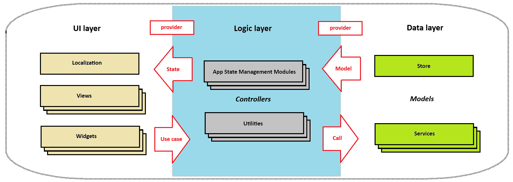

<!-- ABOUT THE PROJECT -->
<a id="readme-top"></a>
# Maali (A Flutter Template)

### *Flutter is an open source framework for building beautiful, natively compiled, multi-platform applications from a single codebase*.

As a data analyst this framework allows me to develop tools quickly for the capturing, structuring and modelling of data offering features like a rich UI, high performance and a fast development process. 

## About

The architecture used here is based on the standard Flutter skeleton template which applies some best practices in structuring a new project. State management is included with a simple class (Provider) from the Flutter SDK that provides change notifications to listeners. This approach uses a model-view-controller configuration with services.

<figure>
    <center>
    
    <center>
</figure>

localised generated messages are based on arb files found in the `lib/src/localization` directory using the **l10n.yaml** file. This will localise the Material packages to one of the 78 available locales. Widgets will automatically adapt to localised messages. To support additional languages, please visit the tutorial on [Internationalizing Flutter
apps](https://flutter.dev/docs/development/accessibility-and-localization/internationalization).

Navigation is done with the Navigator 2.0 pattern using a router to handle routes from the underlying platform to display appropriate pages. This pattern allows flexibility for cross platform applications. Interaction between router, parser and state is described in this article [Learning Flutter’s new navigation and routing system](https://medium.com/flutter/learning-flutters-new-navigation-and-routing-system-7c9068155ade).

Data persistence is achieved by storing key-value data on disk (Store). JSON and serialization methods are applied to easily store structured data as strings which can cause expensive janking computations (> 16ms).

For help getting started with Flutter development, view the [online documentation](https://flutter.dev/docs), which offers tutorials, samples, guidance on mobile development, and a full API reference.

<p align="right">(<a href="#readme-top">back to top</a>)</p>

## Platform Integration

### Build for Android
```
flutter build apk --split-per-abi
```

### Build for Windows
```
flutter build windows
```

### Build for Web
```
flutter build web --release --web-renderer html --base-href /namespace/
```

<p align="right">(<a href="#readme-top">back to top</a>)</p>

## Workflow

MS Visual Studio with extensions is used for coding with emulators through Android Studio.

### Dependencies

| Package | Version | Description |
| -----------   | ----------- | ----------- | 
| Flutter       | v3.13.7 | sdk with Kotlin v1.9.0 & Android API 34 |


<p align="right">(<a href="#readme-top">back to top</a>)</p>

